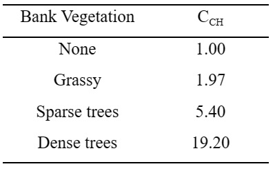
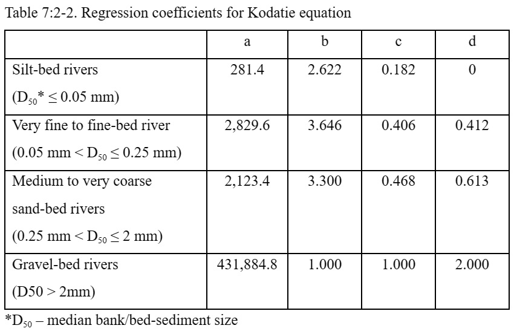
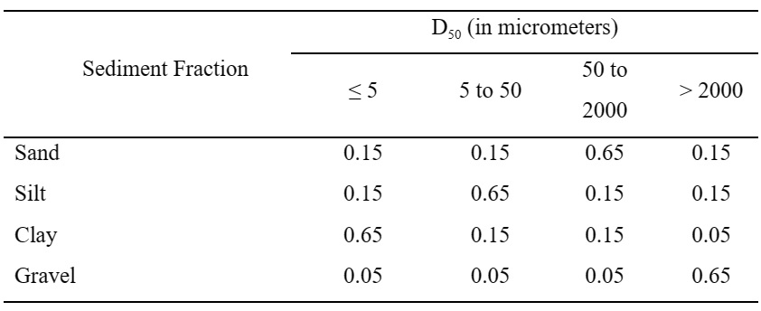

# Physics Based Approach for Channel Erosion

&#x20;              For the channel erosion to occur, both transport and supply should not be limiting, i.e., 1) the stream power (transport capacity) of the water should be high and the sediment load from the upstream regions should be less than this capacity and 2) The shear stress exerted by the water on the bed and bank should be more than the critical shear stress to dislodge the sediment particle.  The potential erosion rates of bank and bed is predicted based on the excess shear stress equation (Hanson and Simon, 2001):

&#x20;            $$\xi_{bank}=k_{d,bank}*(\tau_{e,bank}-\tau_{c,bank})*10^{-6}$$                                                7:2.2.8

&#x20;            $$\xi_{bed}=k_{d,bed}*(\tau_{e,bed}-\tau_{c,bed})*10^{-6}$$                                                        7:2.2.9

where $$\xi$$ – erosion rates of the bank and bed (m/s), $$k_d$$ – erodibility coefficient of bank and $$bed$$ (cm$$^3$$/N-s) and $$\tau_c$$ – Critical shear stress acting on bank and bed (N/m$$^2$$). This equation indicates that effective stress on the channel bank and bed should be more than the respective critical stress for the erosion to occur.

&#x20;              The effective shear stress acting on the bank and bed are calculated using the following equations (Eaton and Millar, 2004):

&#x20;                  $$\frac{\tau_{e,bank}}{\gamma*depth*slp_{ch}}=\frac{SF_{bank}}{100}(\frac{(W+P_{bed})*sin\theta}{4*depth})$$                                                          7:2.2.10

&#x20;                  $$\frac{\tau_{e,bed}}{\gamma_{W}*depth*slp_{ch}}=(1-\frac{SF_{bank}}{100})(\frac{W}{2*P_{bed}}+0.5)$$                                               7:2.2.11

&#x20;                   $$logSF_{bank}=-1.4026*log(\frac{P_{bed}}{P_{bank}}+1.5)+2.247$$                                7:2.2.12

where $$SF_{bank}$$ – proportion of shear stress acting on the bank, $$\tau_e$$ – effective shear stress on bed and bank (N/m$$^2$$),  $$\gamma_W$$ – specific weight of water (9800 N/m$$^3$$), $$depth$$ – Depth of water in the channel (m), $$W$$ – Top width of channel (m), $$P_{bed}$$ – Wetted perimeter of bed (bottom width of channel) (m), $$P_{bank}$$ – Wetted perimeter of channel banks (m), $$\theta$$ – angle of the channel bank from horizontal, $$slp_{ch}$$ – Channel bed slope (m/m).

&#x20;             The effective shear stress calculated by the above equations should be more than the critical shear stress or the tractive force needed to dislodge the sediment.  Critical shear stress for channel bank can be measured using submerged jet test (described later in this chapter).  However, if field data is not available, critical shear stress is estimated using the third-order polynomial fitted to the results of Dunn (1959) and Vanoni (1977) by Julian and Torres (2006) :&#x20;

&#x20;      $$\tau_c=(0.1+0.1779*SC+0.0028*SC^2-2.34*10^{-5}*SC^3)*C_{CH}$$         7:2.2.19

where $$SC$$ – percent silt and clay content and $$C_{CH}$$ – channel vegetation coefficient (range from 1.0 for bare soil to 19.20 for heavy vegetation; see table 7:2-1):

Table 7:2-1. Channel vegetation coefficient for critical shear stress (Julian and Torres, 2006)

Channel erodibility coefficient ($$k_d$$) can also be measured from insitu submerged jet tests.  However, if field data is not available, the model estimates $$k_d$$ using the empirical relation developed by Hanson and Simon (2001).  Hanson and Simon (2001) conducted 83 jet tests on the stream beds of Midwestern USA and established the following relationship between critical shear stress and erodibility coefficient:

&#x20;                          $$k_d=0.2*\tau_c^{-0.5}$$                                                                                           7:2.2.13

where $$k_d$$ – erodibility coefficient (cm$$^3$$/N-s) and $$\tau_c$$ – Critical shear stress (N/m$$^2$$).

&#x20;      Using the above relationships, the bank/bed erosion rate (m/s) can be calculated using eqns. 7:2.2.14 and 7:2.2.15.  This has to be multiplied by the sediment bulk density and area exposed to erosion to get the total mass of sediment that could be eroded.  Due to the meandering nature of the channel, the outside bank in a meander is more prone to erosion than the inside bank.  Hence, the potential bank erosion is calculated by assuming erosion of effectively one channel bank:

&#x20;            $$Bnkrte=\xi_{bnk}*(L_{ch}*1000*depth*\sqrt{1+Z_{ch}^2})*\rho_{b,bank}*86400$$             7:2.2.14

Similarly, the amount of bed erosion is calculated as:

&#x20;            $$Bedrte=\xi_{bed}*(L_{ch}*1000*W_{btm})*\rho_{b,bed}*86400$$                                       7:2.2.15

where $$Bnkrte,Bedrte$$ – potential bank and bed erosion rates (Metric tons per day), $$L_{ch}$$– length of the channel (m),$$depth$$– depth of water flowing in the channel (m), $$W_{btm}$$– Channel bottom width (m), $$\rho_{b,bank},\rho_{b,bed}$$– bulk density of channel bank and bed sediment (g/cm$$^3$$or Metric tons/m$$^3$$ or Mg/m$$^3$$).  The relative erosion potential is used to partition the erosion in channel among stream bed and stream bank if the transport capacity of the channel is high.   The relative erosion potential of stream bank and bed is calculated as:

&#x20;                         $$Bnk_{rp}=\frac{Bnkrte}{Bnkrte+Bedrte}$$                                                                                 7:2.2.16

&#x20;                        $$Bed_{rp}=1-Bnk_{rp}$$                                                                                       7:2.2.17

&#x20;            SWAT+ currently has four stream power models to predict the transport capacity of channel.  The stream power models predict the maximum concentration of bed load it can carry as a non-linear function of peak velocity:

&#x20;                       $$conc_{sed,ch.mx}=f(peak$$ $$velocity)$$                                                               7:2.2.18

where $$conc_{sed,ch.mx}$$ – maximum concentration of sediment that can be transported by the water (Metric ton/m$$^3$$).  The stream power models currently used in SWAT+ are 1) Simplified Bagnold model 2) Kodatie model (for streams with bed material size ranging from silt to gravel) 3) Molinas and Wu model (for primarily sand size particles) and 4) Yang sand and gravel model (for primarily sand and gravel size particles).&#x20;

1. **Simplified Bagnold model:** (same as eqn. 7:2.2.9)

&#x20;                     $$conc_{sed,ch,mx}=c_{sp}*v_{ch,pk}^{spexp}$$                                                                           7:2.2.19

&#x20;      where $$conc_{sed,ch,mx}$$ is the maximum concentration of sediment that can be transported by the water (ton/m$$^3$$ or kg/L), $$c_{sp}$$ is a coefficient defined by the user, $$v_{ch,pk}$$ is the peak channel velocity (m/s), and $$spexp$$ is an exponent defined by the user. The exponent, $$spexp$$, normally varies between 1.0 and 2.0 and was set at 1.5 in the original Bagnold stream power equation (Arnold et al., 1995).

&#x20;  **2. Kodatie model**&#x20;

&#x20;                       Kodatie (2000) modified the equations developed by Posada (1995) using nonlinear optimization and field data for different sizes of riverbed sediment.  This method can be used for streams with bed material in size ranging from silt to gravel:

&#x20;                    $$conc_{sed,ch,mx}=(\frac{a.v_{ch}^b*y^c*S^d}{Q_{in}})*(\frac{W+W_{btm}}{2})$$                                                     7:2.2.20

where $$v_{ch}$$ – mean flow velocity (m/s), y – mean flow depth (m), S – Energy slope, assumed to be the same as bed slope (m/m), (a,b,c and d) – regression coefficients for different bed materials (Table 7:2-1), $$Q_{in}$$ – Volume of water entering the reach in the day (m$$^3$$), W – width of the channel at the water level (m), $$W_{btm}$$ – bottom width of the channel (m).

&#x20;  **3. Molinas and Wu model:**

&#x20;                    Molinas and Wu (2001) developed a sediment transport equation for large sand-bed rivers based on universal stream power.  The transport equation is of the form:

&#x20;                            $$C_W=M\Psi^N$$                                                                                   7:2.2.21

&#x20;where $$C_W$$ – is the concentration of sediments by weight, $$\Psi$$ – universal stream power, $$M$$ and $$N$$ are coefficients.  This equation was fitted to 414 sets of large river bed load data including rivers such as Amazon, Mississippi.  The resulting expression is:

&#x20;                        $$C_W=\frac{1430*(0.86+\sqrt \Psi)*\Psi^{1.5}}{0.016+\Psi}*10^{-6}$$                                                    7:2.2.22

where $$\Psi$$ – universal stream power is given by:

&#x20;                           $$\Psi=\frac{\Psi^3}{(S_g-1)*g*depth*\omega_{50}*[log_{10}(\frac{depth}{D_{50}})]^2}$$                                                7:2.2.23

&#x20;  where $$S_g$$ – relative density of the solid (2.65), $$g$$ – acceleration due to gravity (9.81 m/s$$^2$$), $$depth$$ – flow depth (m), $$\omega_{50}$$ – fall velocity of median size particles (m/s), $$D_{50}$$ – median sediment size.  The fall velocity is calculated using Stokes’ Law by assuming a temperature of 22ºC and a sediment density of 1.2 t/m3:

&#x20;                              $$\omega_{50}=\frac{411*D_{50}^2}{3600}$$                                                                            7:2.2.24

The concentration by weight is converted to concentration by volume and the maximum bed load concentration in metric tons/m$$^3$$ is calculated as:

&#x20;                            $$conc_{sed,ch,mx}=\frac{C_W}{C_W+(1-C_W)*S_g}*S_g$$                                          7:2.2.25

&#x20;    **4. Yang sand and gravel model**

&#x20;                   Yang (1996) related total load to excess unit stream power expressed as the product of velocity and slope.  Separate equations were developed for sand and gravel bed material and solved for sediment concentration in ppm by weight.  The regression equations were developed based on dimensionless combinations of unit stream power, critical unit stream power, shear velocity, fall velocity, kinematic viscosity and sediment size.  The sand equation, which should be used for median sizes ($$D_{50}$$) less than 2mm is:

$$logC_W=5.435-0.286log\frac{\omega_{50}D_{50}}{\upsilon}-0.457log\frac{V_*}{\omega_{50}}\\+(1.799-0.409log\frac{\omega_{50}D_{50}}{\upsilon}-0.3141log\frac{V_*}{\omega_{50}})log(\frac{v_{ch}S}{\omega_{50}}-\frac{V_{cr}S}{\omega_{50}})$$                             7:2.2.26

and the gravel equation for D50 between 2mm and 10mm:

$$logC_W=6.681-0.6331log\frac{\omega_{50}D_{50}}{\upsilon}-4.816log\frac{V_*}{\omega_{50}}+\\(2.784-0.305log\frac{\omega_{50}D_{50}}{\upsilon}-0.282log\frac{V_*}{\omega_{50}})log(\frac{v_{ch}S}{\omega_{50}}-\frac{V_{cr}S}{\omega_{50}})$$                                  7:2.2.27

where $$C_W$$ – Sediment concentration in parts per million by weight, $$\omega_{50}$$ – fall velocity of the median size sediment (m/s), $$v$$ – Kinematic viscosity (m$$^2$$/s), $$V_*$$ - Shear velocity $$(\sqrt{gRS})$$(m/s), $$v_{ch}$$ – mean channel velocity (m/s), $$V_{cr}$$ – Critical velocity (m/s), and $$S$$ – Energy slope, assumed to be the same as bed slope (m/m).

&#x20;             From the above equations, $$C_W$$ in ppm is divided by 10$$^6$$ to convert in to concentration by weight.  Using eq. 7:2.2.32,$$C_W$$ is converted in to maximum bed load concentration($$conc_{sed,ch,mx}$$) in metric tons/m$$^3$$.

&#x20;              By using one of the four models discussed above, the maximum sediment transport capacity of the channel can be calculated.   The excess transport capacity available in the channel is calculated as:

&#x20;               $$SedEx=V_{ch}*(conc_{sed,ch,mx}-conc_{sed,ch,i})$$                                           7:2.2.28

If $$SedEX$$ is < 0 then the channel does not have the capacity to transport eroded sediments and hence there will be no bank and bed erosion.  If $$SedEX$$ is > 0 then the channel has the transport capacity to support eroded bank and bed sediments.  Before channel degradation bank erosion, the deposited sediment during the previous time steps will be resuspended and removed.  The excess transport capacity available after resuspending the deposited sediments is removed from channel bank and channel bed.   &#x20;

&#x20;             $$Bnk_{deg}=SedEX* Bnk_{rp},   SedEX*Bnk_{rp} \le Bnkrte \\ Bnk_{deg}=Bnkrte,  SedEX*Bnk_{rp}>Bnkrte$$                        7:2.2.29

&#x20;             $$Bed_{deg}=SedEX*Bed_{rp},SedEX*Bed_{rp}\le Bedrte \\ Bed_{deg}=Bedrte , SedEX*Bed_{rp}>Bedrte$$                         7:2.2.30

&#x20;             $$sed_{deg}=Bank_{deg}+Bed_{deg}$$                                                                         7:2.2.31

&#x20; where $$Bnk_{deg}$$ – is the amount of bank erosion in metric tons, $$Bed_{deg}$$ – is the amount of bed erosion in metric tons, $$sed_{deg}$$ – is the total channel erosion from channel bank and bed in metric tons.  Particle size contribution from bank erosion is calculated as:       &#x20;

&#x20;            $$Bnksan=Bnk_{deg}*Bnksanfr_i \\ Bnksil=Bnk_{deg}*Bnksilfr_i \\ Bnkcla=Bnk_{deg}*Bnkclafr_i \\ Bnkgra=Bnk_{deg}*Bnkgrafr_i$$                                                              7:2.2.32

where $$Bnksan$$ – is the amount of sand eroded from bank in metric tons, $$Bnksil$$ – is the amount of silt eroded from bank, $$Bnkcla$$ – is the amount of clay eroded from bank, $$Bnkgra$$ – is the amount of gravel eroded from bank; $$Bnksanfr_i$$, $$Bnksilfr_i$$,$$Bnkclafr_i$$, and $$Bnkgrafr_i$$ – fraction of sand, silt, clay and gravel content of bank in channel $$i$$.  Similarly the particle size contribution from bed erosion is also calculated separately.

&#x20;             The particle size distribution indicated in Table 7:2-3 for bank and bed sediments is assumed by the model based on the median sediment size ($$BnkD_{50}$$,$$BedD_{50}$$) input by the user.  If the median sediment size is not specified by the user, then the model assumed $$BnkD_{50}$$ and $$BedD_{50}$$ to be 50 micrometer (0.05 mm) equivalent to the silt size particles.

Table 7:2-3.  Particle size distribution assumed by SWAT+ based on the median size of bank and bed sediments

&#x20;     Deposition of bedload sediments in channel is modeled using the following equations (Einstein 1965; Pemberton and Lara 1971):

&#x20;              $$Pdep_z=(1-\frac{1}{e^x})*100$$ $$where \\$$                 &#x20;

&#x20;              $$x=\frac{1.055*L_{ch}*1000*\omega}{v_{ch}*depth}$$                                                                                            7:2.2.33

&#x20;  where $$Pdep$$ -  is the percentage of sediments ($$z$$ - sand, silt, clay, and gravel) that get deposited, $$L_{ch}$$ – length of the reach (km), $$\omega$$ – fall velocity of the sediment particles in m/s (eq. 7:2.2.31),     $$v_{ch}$$ – mean flow velocity in the reach (m/s), and $$depth$$ – is the depth of water in the channel (m).The particle size diameters assumed to calculate the fall velocity are 0.2mm, 0.01mm, 0.002mm, 2 mm, 0.0300, 0.500 respectively for sand, silt, clay, gravel, small aggregate and large aggregate.

&#x20;          It should be kept in mind that small aggregate and large aggregates in the bedload are contributed only from overland erosion and routed through the channel. Gravel is contributed only from channel erosion. Only sand, silt and clay in the bedload is contributed both from overland and channel erosion.\
&#x20;          If the water in the channel enters the floodplain during large storm events, then silt and clay particles are deposited in the floodplains and the main channel in proportion to their flow cross-sectional areas. Silt and clay deposited in the flooplain are assumed to be lost from the system and is not resuspended during subsequent time steps as in the main channel. The complete mass balance equations for sediment routing are as follows:

&#x20;$$sed_{ch}=sed_{ch,i}-sed_{dep}+sed_{deg}$$     $$where$$

&#x20;$$sed_{ch,i}=san_{ch,i}+sil_{ch,i}+cla_{ch,i}+gra_{ch,i}+sagg_{ch,i}+lagg_{ch,i}$$

$$sed_{dep}=san_{ch,i}*Pdep_{san}+sil_{ch,i}*Pdep_{sil}+cla_{ch,i}*Pdep_{cla}+gra_{ch,i}*Pdep_{gra}+sagg_{ch,i}*Pdep_{sagg}+lagg_{ch,i}*Pdep_{lagg}$$

$$sed_{deg}=Bnk_{deg}+Bed_{deg}$$      $$where$$

&#x20;            $$Bnk_{deg}=Bnksan+Bnksil+Bnkcla+Bnkgra$$

&#x20;             $$Bed_{deg}=Bedsan+Bedsil+Bedcla+Bedgra$$                                   7:2.2.34

where $$sed_{ch}$$ is the amount of suspended sediment in the reach (metric tons), $$sed_{ch,i}$$ is the amount of suspended sediment entering the reach at the beginning of the time period (metric tons), $$sed_{dep}$$ is the amount of sediment deposited in the reach segment (metric tons), and $$sed_{deg}$$ is the amount of sediment contribution from bank and bed erosion in the reach segment (metric tons).

&#x20;        The amount of sediment transported out of the reach is calculated:

&#x20;                           $$sed_{out}=sed_{ch}*\frac{V_{out}}{V_{ch}}$$                                                                        7:2.2.35

where $$sed_{out}$$ is the amount of sediment transported out of the reach (metric tons), $$sed_{ch}$$ is the amount of suspended sediment in the reach (metric tons), $$V_{out}$$ is the volume of outflow during the time step (m$$^3$$ H$$_2$$O), and $$V_{ch}$$ is the volume of water in the reach segment (m$$^3$$ H$$_2$$O).
