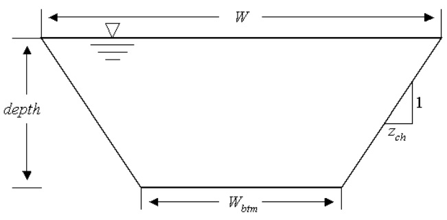
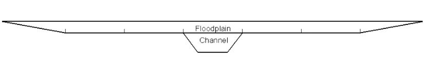

# Channel Characteristics

SWAT+ assumes the main channels, or reaches, have a trapezoidal shape (Figure 7:1-1).

Users are required to define the width and depth of the channel when filled to the top of the bank as well as the channel length, slope along the channel length and Manning’s “n” value. SWAT+ assumes the channel sides have a 2:1 run to rise ratio ($$z_{ch}$$ = 2). The slope of the channel sides is then ½ or 0.5. The bottom width is calculated from the $$bankfull$$ width and depth with the equation:

&#x20;                  $$W_{btm}=W_{bnkfull}-2*z_{ch}*depth_{bnkfull}$$                                             7:1.1.1

where $$W_{btm}$$ is the bottom width of the channel (m), $$W_{bnkfull}$$ is the top width of the channel when filled with water (m), $$z_{ch}$$ is the inverse of the channel side slope, and $$depth_{bnkfull}$$ is the depth of water in the channel when filled to the top of the bank (m). Because of the assumption that $$z_{ch}=2$$, it is possible for the bottom width calculated with equation 7:1.1.1 to be less than or equal to zero. If this occurs, the model sets $$W_{btm}=0.5*W_{bnkfull}$$  and calculates a new value for the channel side slope run by solving equation 7:1.1.1 for $$z_{ch}$$:

&#x20;                             $$z_{ch}=\frac{(W_{bnkfull}-W_{btm})}{2*depth_{bnkfull}}$$                                                                        7:1.1.2

For a given depth of water in the channel, the width of the channel at water level is:

&#x20;                             $$W=W_{btm}+2*z_{ch}*depth$$                                                      7:1.1.3

where $$W$$ is the width of the channel at water level (m), $$W_{btm}$$ is the bottom width of the channel (m), $$z_{ch}$$ is the inverse of the channel slope, and $$depth$$ is the depth of water in the channel (m). The cross-sectional area of flow is calculated:

&#x20;                             $$A_{ch}=(W_{btm}+z_{ch}*depth)*depth$$                                         7:1.1.4

where $$A_{ch}$$ is the cross-sectional area of flow in the channel (m$$^2$$), $$W_{btm}$$ is the bottom width of the channel (m), $$z_{ch}$$ is the inverse of the channel slope, and $$depth$$ is the depth of water in the channel (m). The wetted perimeter of the channel is defined as

&#x20;                               $$P_{ch}=W_{btm}+2*depth*\sqrt{1+z_{ch}^2}$$                                      7:1.1.5

where $$P_{ch}$$ is the wetted perimeter for a given depth of flow (m). The hydraulic radius of the channel is calculated

&#x20;                                $$R_{ch}=\frac{A_{ch}}{P_{ch}}$$                                                                                    7:1.1.6

where $$R_{ch}$$ is the hydraulic radius for a given depth of flow (m), $$A_{ch}$$ is the cross-sectional area of flow in the channel (m$$^2$$), and $$P_{ch}$$ is the wetted perimeter for a given depth of flow (m). The volume of water held in the channel is&#x20;

&#x20;                                $$V_{ch}=1000*L_{ch}*A_{ch}$$                                                             7.1.1.7

where $$V_{ch}$$ is the volume of water stored in the channel (m$$^3$$), $$L_{ch}$$ is the channel length (km), and $$A_{ch}$$ is the cross-sectional area of flow in the channel for a given depth of water (m$$^2$$).&#x20;

&#x20;        When the volume of water in the reach exceeds the maximum amount that can be held by the channel, the excess water spreads across the flood plain. The flood plain dimensions used by SWAT+ are shown in Figure 7:1-2.&#x20;

The bottom width of the floodplain, $$W_{btm,fld}$$, is $$W_{btm,fld}=5*W_{bnkfull}$$. SWAT+ assumes the flood plain side slopes have a 4:1 run to rise ratio ($$z_{fld}$$ = 4). The slope of the flood plain sides is then ¼ or 0.25.&#x20;

&#x20;           When flow is present in the flood plain, the calculation of the flow depth, cross-sectional flow area and wetting perimeter is a sum of the channel and floodplain components:

&#x20;                                $$depth=depth_{bnkfull}+depth_{fld}$$                                                       7:1.1.8

$$A_{ch}=(W_{btm}+z_{ch}*depth_{bnkfull})*depth_{bnkfull}+(W_{btm,fld}+z_{fld}+depth_{fld})*depth_{fld}$$

&#x20;                                                                                                                                                7:1.1.9

$$P_{ch}=W_{btm}+2*depth_{bnkfull}*\sqrt{1+z_{ch}^2}+4*W_{bnkfull}+2*depth_{fld}*\sqrt{1+z_{fld}^2}$$

&#x20;                                                                                                                                                7:1.1.10

where $$depth$$ is the total depth of water (m), $$depth_{bnkfull}$$ is the depth of water in the channel when filled to the top of the bank (m), $$depth_{fld}$$ is the depth of water in the flood plain (m), $$A_{ch}$$ is the cross-sectional area of flow for a given depth of water (m$$^2$$), $$W_{btm}$$ is the bottom width of the channel (m), $$z_{ch}$$ is the inverse of the channel side slope, $$W_{btm,fld}$$ is the bottom width of the flood plain (m), $$z_{fld}$$ is the inverse of the flood plain side slope, $$P_{ch}$$ is the wetted perimeter for a given depth of flow (m), and $$W_{bnkfull}$$ is the top width of the channel when filled with water (m).

Table 7:1-1: SWAT+ input variables that pertain to channel dimension calculations.

| Variable Name | Definition                                                             | File Name |
| ------------- | ---------------------------------------------------------------------- | --------- |
| CH\_W(2)      | $$W_{bnkfull}$$: Width of channel at top of bank (m)                   | .rte      |
| CH\_D         | $$depth_{bnkfull}$$: Depth of water in channel when filled to bank (m) | .rte      |
| CH\_L(2)      | $$L_{ch}$$: Length of main channel (km)                                | .rte      |
