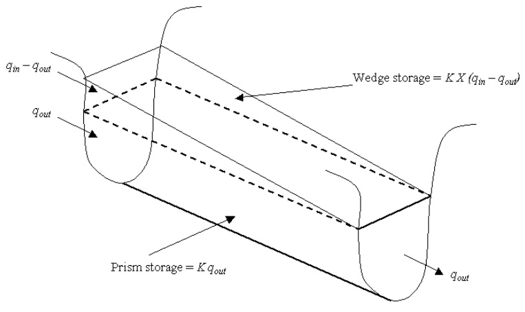

# Muskingum Routing Method

The Muskingum routing method models the storage volume in a channel length as a combination of wedge and prism storages (Figure 7:1-3).

&#x20;          When a flood wave advances into a reach segment, inflow exceeds outflow and a wedge of storage is produced. As the flood wave recedes, outflow exceeds inflow in the reach segment and a negative wedge is produced. In addition to the wedge storage, the reach segment contains a prism of storage formed by a volume of constant cross-section along the reach length.

&#x20;          As defined by Manning’s equation (equation 7:1.2.1), the cross-sectional area of flow is assumed to be directly proportional to the discharge for a given reach segment. Using this assumption, the volume of prism storage can be expressed as a function of the discharge, $$K*q_{out}$$, where $$K$$ is the ratio of storage to discharge and has the dimension of time. In a similar manner, the volume of wedge storage can be expressed as  $$K*X*(q_{in}-q_{out})$$, where $$X$$ is a weighting factor that controls the relative importance of inflow and outflow in determining the storage in a reach. Summing these terms gives a value for total storage

&#x20;               $$V_{stored}=K*q_{out}+K*X*(q_{in}-q_{out})$$                                                   7:1.4.1

where $$V_{stored}$$ is the storage volume (m$$^3$$ H$$_2$$O), $$q_{in}$$ is the inflow rate (m$$^3$$/s), $$q_{out}$$ is the discharge rate (m$$^3$$/s), $$K$$ is the storage time constant for the reach (s), and $$X$$ is the weighting factor. This equation can be rearranged to the form

&#x20;              $$V_{stored}=K*(X*q_{in}+(1-X)*q_{out})$$                                                  7:1.4.2

This format is similar to equation 7:1.3.7.

&#x20;               The weighting factor, $$X$$, has a lower limit of 0.0 and an upper limit of 0.5. This factor is a function of the wedge storage. For reservoir-type storage, there is no wedge and $$X=0.0$$. For a full-wedge, $$X=0.5$$. For rivers, $$X$$ will fall between 0.0 and 0.3 with a mean value near 0.2.&#x20;

&#x20;              The definition for storage volume in equation 7:1.4.2 can be incorporated into the continuity equation (equation 7:1.3.2) and simplified to

&#x20;                $$q_{out,2}=C_1*q_{in,2}+C_2*q_{in,1}+C_3*q_{out,1}$$                                              7:1.4.3

where $$q_{in,1}$$ is the inflow rate at the beginning of the time step (m$$^3$$/s), $$q_{in,2}$$ is the inflow rate at the end of the time step (m$$^3$$/s), $$q_{out,1}$$ is the outflow rate at the beginning of the time step (m$$^3$$/s), $$q_{out,2}$$ is the outflow rate at the end of the time step (m$$^3$$/s), and

&#x20;                 $$C_1=\frac{\Delta t-2*K*X}{2*K*(1-X)+\Delta t}$$                                                                                     7:1.4.4

&#x20;                 $$C_2=\frac{\Delta t+2*K*X}{2*K*(1-X)+ \Delta t}$$                                                                                     7:1.4.5

&#x20;                 $$C_3=\frac{2*K*(1-X)- \Delta t}{2*K*(1-X)+\Delta t}$$                                                                                     7:1.4.6

where $$C_1+C_2+C_3=1$$. To express all values in units of volume, both sides of equation 7:1.4.3 are multiplied by the time step

&#x20;                   $$V_{out,2}=C_1*V_{in,2}+C_2*V_{in,1}+C_3*V_{out,1}$$                                       7:1.4.7

To maintain numerical stability and avoid the computation of negative outflows, the following condition must be met:

&#x20;                  $$2*K*X<\Delta t<2*K*(1-X)$$                                                     7:1.4.8

The value for the weighting factor, $$X$$, is input by the user. The value for the storage time constant is estimated as:

&#x20;                  $$K=coef_1*K_{bnkfull}+coef_2*K_{0.1bnkfull}$$                                            7:1.4.9

where $$K$$ is the storage time constant for the reach segment (s), $$coef_1$$ and $$coef_2$$ are weighting coefficients input by the user, $$K_{bnkfull}$$ is the storage time constant calculated for the reach segment with bankfull flows (s), and $$K_{0.1bnkfull}$$ is the storage time constant calculated for the reach segment with one-tenth of the bankfull flows (s). To calculate $$K_{bnkfull}$$ and $$K_{0.1bnkfull}$$, an equation developed by Cunge (1969) is used:

&#x20;                  $$K=\frac{1000*L_{ch}}{c_k}$$                                                                                                7:1.4.10

where $$K$$ is the storage time constant (s), $$L_{ch}$$ is the channel length (km), and $$c_k$$ is the celerity corresponding to the flow for a specified depth (m/s). Celerity is the velocity with which a variation in flow rate travels along the channel. It is defined as

&#x20;                   $$c_k=\frac{d}{dA_{ch}}(q_{ch})$$                                                                                            7:1.4.11

where the flow rate, $$q_{ch}$$, is defined by Manning’s equation. Differentiating equation 7:1.2.1 with respect to the cross-sectional area gives

&#x20;                   $$c_k=\frac{5}{3}*(\frac{R_{ch}^{2/3}*slp_{ch}^{1/2}}{n})=\frac{5}{3}*v_c$$                                                                  7:1.4.12

where $$c_k$$ is the celerity (m/s), $$R_{ch}$$ is the hydraulic radius for a given depth of flow (m), $$slp_{ch}$$ is the slope along the channel length (m/m), n is Manning’s “$$n$$” coefficient for the channel, and $$v_c$$ is the flow velocity (m/s).

Table 7:1-3: SWAT+ input variables that pertain to Muskingum routing.

| Variable Name | Definition                                                                               | File Name |
| ------------- | ---------------------------------------------------------------------------------------- | --------- |
| MSK\_X        | $$X$$: weighting factor                                                                  | .bsn      |
| MSK\_CO1      | $$coef_1$$: weighting factor for influence of normal flow on storage time constant value | .bsn      |
| MSK\_CO2      | $$coef_2$$: weighting factor for influence of low flow on storage time constant          | .bsn      |
