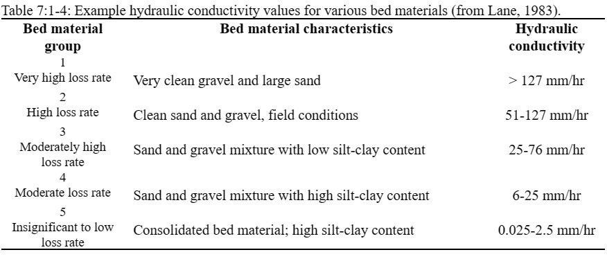

# Transmission Losses

The classification of a stream as ephemeral, intermittent or perennial is a function of the amount of groundwater contribution received by the stream. Ephemeral streams contain water during and immediately after a storm event and are dry the rest of the year. Intermittent streams are dry part of the year, but contain flow when the groundwater is high enough as well as during and after a storm event. Perennial streams receive continuous groundwater contributions and flow throughout the year.&#x20;

&#x20;       During periods when a stream receives no groundwater contributions, it is possible for water to be lost from the channel via transmission through the side and bottom of the channel. Transmission losses are estimated with the equation

&#x20;                              $$tloss=K_{ch}*TT*P_{ch}*L_{ch}$$                                                            7:1.5.1

where $$tloss$$ are the channel transmission losses (m$$^3$$ H$$_2$$O), $$K_{ch}$$ is the effective hydraulic conductivity of the channel alluvium (mm/hr), $$TT$$ is the flow travel time (hr), $$P_{ch}$$ is the wetted perimeter (m), and $$L_{ch}$$ is the channel length (km). Transmission losses from the main channel are assumed to enter bank storage or the deep aquifer.

&#x20;        Typical values for $$K_{ch}$$ for various alluvium materials are given in Table 7:1-4. For perennial streams with continuous groundwater contribution, the effective conductivity will be zero.

Table 7:1-5: SWAT+ input variables that pertain to transmission losses.

| Variable Name | Definition                                                      | File Name |
| ------------- | --------------------------------------------------------------- | --------- |
| CH\_K(2)      | $$K_{ch}$$: Effective hydraulic conductivity of channel (mm/hr) | .rte      |
| CH\_L(2)      | $$L_{ch}$$: Length of main channel (km)                         | .rte      |
