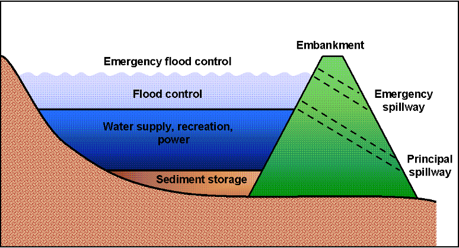

# Reservoirs

A reservoir is an impoundment located on the main channel network of a watershed. No distinction is made between naturally-occurring and man-made structures. The features of an impoundment are shown in Figure 8:1.1.

&#x20;       The water balance for a reservoir is:

&#x20;               $$V=V_{stored}+V_{flowin}-V_{flowout}+V_{pcp}-V_{evap}-V_{seep}$$          8:1.1.1

where $$V$$ is the volume of water in the impoundment at the end of the day (m$$^3$$ H$$_2$$O), $$V_{stored}$$ is the volume of water stored in the water body at the beginning of the day         (m$$^3$$ H$$_2$$O), $$V_{flowin}$$ is the volume of water entering the water body during the day           (m$$^3$$ H$$_2$$O), $$V_{flowout}$$ is the volume of water flowing out of the water body during the day (m$$^3$$ H$$_2$$O), $$V_{pcp}$$ is the volume of precipitation falling on the water body during the day   (m$$^3$$ H$$_2$$O), $$V_{evap}$$ is the volume of water removed from the water body by evaporation during the day (m$$^3$$ H$$_2$$O), and $$V_{seep}$$ is the volume of water lost from the water body by seepage (m$$^3$$ H$$_2$$O).
