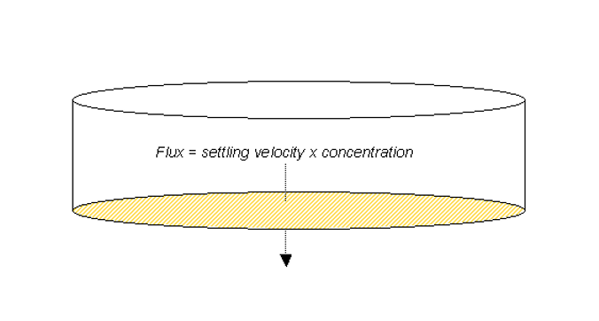

# Nutrient Transformations

When calculating nutrient transformations in a water body, SWAT+ assumes the system is completely mixed. In a completely mixed system, as nutrients enter the water body they are instantaneously distributed throughout the volume. The assumption of a completely mixed system ignores lake stratification and intensification of phytoplankton in the epilimnion.

The initial amount of nitrogen and phosphorus in the water body on the given day is calculated by summing the mass of nutrient entering the water body on that day with the mass of nutrient already present in the water body.

&#x20;         $$M_{initial}=M_{stored}+M_{flowin}$$                                                 8:3.1.1

where $$M_{initial}$$ is the initial mass of nutrient in the water body for the given day (kg), $$M_{stored}$$ is the mass of nutrient in the water body at the end of the previous day (kg), and $$M_{flowin}$$ is the mass of nutrient added to the water body on the given day (kg).

In a similar manner, the initial volume of water in the water body is calculated by summing the volume of water entering the water body on that day with the volume already present in the water body.

&#x20;          $$V_{initial}=V_{stored}+V_{flowin}$$                                                     8:3.1.2

where $$V_{initial}$$ is the initial volume of water in the water body for a given day (m$$^3$$ H$$_2$$O), $$V_{stored}$$ is the volume of water in the water body at the end of the previous day (m$$^3$$ H$$_2$$O), and $$V_{flowin}$$ is the volume of water entering the water body on the given day (m$$^3$$ H$$_2$$O).

The initial concentration of nutrients in the water body is calculated by dividing the initial mass of nutrient by the initial volume of water.

Nutrient transformations simulated in ponds, wetlands and reservoirs are limited to the removal of nutrients by settling. Transformations between nutrient pools (e.g. NO3 $$\iff$$ NO2 $$\iff$$ NH4) are ignored.

\
&#x20;           Settling losses in the water body can be expressed as a flux of mass across the surface area of the sediment-water interface (Figure 8:3-1) (Chapra, 1997).

The mass of nutrient lost via settling is calculated by multiplying the flux by the area of the sediment-water interface.

&#x20;                $$M_{settling}=v*c*A_s*dt$$                                                    8:3.1.3

where $$M_{settling}$$ is the mass of nutrient lost via settling on a day (kg), $$v$$ is the apparent settling velocity (m/day), $$A_s$$ is the area of the sediment-water interface (m$$^2$$), $$c$$ is the initial concentration of nutrient in the water (kg/m$$^3$$ H$$_2$$O), and $$dt$$ is the length of the time step (1 day). The settling velocity is labeled as “apparent” because it represents the net effect of the different processes that deliver nutrients to the water body’s sediments. The water body is assumed to have a uniform depth of water and the area of the sediment-water interface is equivalent to the surface area of the water body.

&#x20;           The apparent settling velocity is most commonly reported in units of m/year and this is how the values are input to the model. For natural lakes, measured phosphorus settling velocities most frequently fall in the range of 5 to 20 m/year although values less than 1 m/year to over 200 m/year have been reported (Chapra, 1997). Panuska and Robertson (1999) noted that the range in apparent settling velocity values for man-made reservoirs tends to be significantly greater than for natural lakes. Higgins and Kim (1981) reported phosphorus apparent settling velocity values from –90 to 269 m/year for 18 reservoirs in Tennessee with a median value of 42.2 m/year. For 27 Midwestern reservoirs, Walker and Kiihner (1978) reported phosphorus apparent settling velocities ranging from –1 to 125 m/year with an average value of 12.7 m/year. _**A negative settling rate indicates that the reservoir sediments are a source of N or P; a positive settling rate indicates that the reservoir sediments are a sink for N or P**_.

A number of inflow and impoundment properties affect the apparent settling velocity for a water body. Factors of particular importance include the form of phosphorus in the inflow (dissolved or particulate) and the settling velocity of the particulate fraction. Within the impoundment, the mean depth, potential for sediment resuspension and phosphorus release from the sediment will affect the apparent settling velocity (Panuska and Robertson, 1999). Water bodies with high internal phosphorus release tend to possess lower phosphorus retention and lower phosphorus apparent settling velocities than water bodies with low internal phosphorus release (Nürnberg, 1984). Table 8:3-1 summarizes typical ranges in phosphorus settling velocity for different systems.

Table 8:3-1: Recommended apparent settling velocity values for phosphorus (Panuska and Robertson, 1999)

| Nutrient Dynamics                                           | Range in settling velocity values (m/year) |
| ----------------------------------------------------------- | ------------------------------------------ |
| Shallow water bodies with high net internal phosphorus flux | $$v \le 0$$                                |
| Water bodies with moderate net internal phosphorus flux     | $$1<v<5$$                                  |
| Water bodies with minimal net internal phosphorus flux      | $$5<v<16$$                                 |
| Water bodies with high net internal phosphorus removal      |  $$v>16$$                                  |

SWAT+ input variables that pertain to nutrient settling in ponds, wetlands and reservoirs are listed in Table 8:3-2. The model allows the user to define two settling rates for each nutrient and the time of the year during which each settling rate is used. A variation in settling rates is allowed so that impact of temperature and other seasonal factors may be accounted for in the modeling of nutrient settling. To use only one settling rate for the entire year, both variables for the nutrient may be set to the same value. Setting all variables to zero will cause the model to ignore settling of nutrients in the water body.

After nutrient losses in the water body are determined, the final concentration of nutrients in the water body is calculated by dividing the final mass of nutrient by the initial volume of water. The concentration of nutrients in outflow from the water body is equivalent to the final concentration of the nutrients in the water body for the day. The mass of nutrient in the outflow is calculated by multiplying the concentration of nutrient in the outflow by the volume of water leaving the water body on that day.

| Variable Name | Definition                                                                                                                               | Input File |
| ------------- | ---------------------------------------------------------------------------------------------------------------------------------------- | ---------- |
| IPND1         | Beginning month of mid-year nutrient settling period for pond and wetland modeled in subbasin                                            | .pnd       |
| IPND2         | Ending month of mid-year nutrient settling period for pond and wetland modeled in subbasin                                               | .pnd       |
| PSETL1        | Phosphorus settling rate in pond during mid-year nutrient settling period (_IPND1_ $$\le$$ _month_ $$\le$$ _IPND2_) (m/year)             | .pnd       |
| PSETL2        | Phosphorus settling rate in pond during time outside mid-year nutrient settling period ( _month < IPND1 or month > IPND2_) (m/year)      | .pnd       |
| NSETL1        | Nitrogen settling rate in pond during mid-year nutrient settling period (_IPND1_ $$\le$$ _month_ $$\le$$ _IPND2_) (m/year)               | .pnd       |
| NSETL2        | Nitrogen settling rate in pond during time outside mid-year nutrient settling period ( _month < IPND1 or month > IPND2_) (m/year)        | .pnd       |
| PSETLW1       | Phosphorus settling rate in wetland during mid-year nutrient settling period (_IPND1_ $$\le$$ _month_  $$\le$$_IPND2_) (m/year)          | .pnd       |
| PSETLW2       | Phosphorus settling rate in wetland during time outside mid-year nutrient settling period ( _month < IPND1 or month > IPND2_) (m/year)   | .pnd       |
| NSETLW1       | Nitrogen settling rate in wetland during mid-year nutrient settling period (_IPND1_ $$\le$$ _month_ $$\le$$_IPND2_) (m/year)             | .pnd       |
| NSETLW2       | Nitrogen settling rate in wetland during time outside mid-year nutrient settling period ( _month < IPND1 or month > IPND2_) (m/year)     | .pnd       |
| IRES1         | Beginning month of mid-year nutrient settling period for reservoir                                                                       | .lwq       |
| IRES2         | Ending month of mid-year nutrient settling period for reservoir                                                                          | .lwq       |
| PSETLR1       | Phosphorus settling rate in reservoir during mid-year nutrient settling period (_IRES1_ $$\le$$ _month_ $$\le$$ _IRES2_) (m/year)        | .lwq       |
| PSETLR2       | Phosphorus settling rate in reservoir during time outside mid-year nutrient settling period ( _month < IRES1 or month > IRES2_) (m/year) | .lwq       |
| NSETLR1       | Nitrogen settling rate in reservoir during mid-year nutrient settling period (_IRES1_ $$\le$$ _month_ $$\le$$_IRES2_) (m/year)           | .lwq       |
| NSETLR2       | Nitrogen settling rate in reservoir during time outside mid-year nutrient settling period ( _month < IRES1 or month > IRES2_) (m/year)   | .lwq       |
