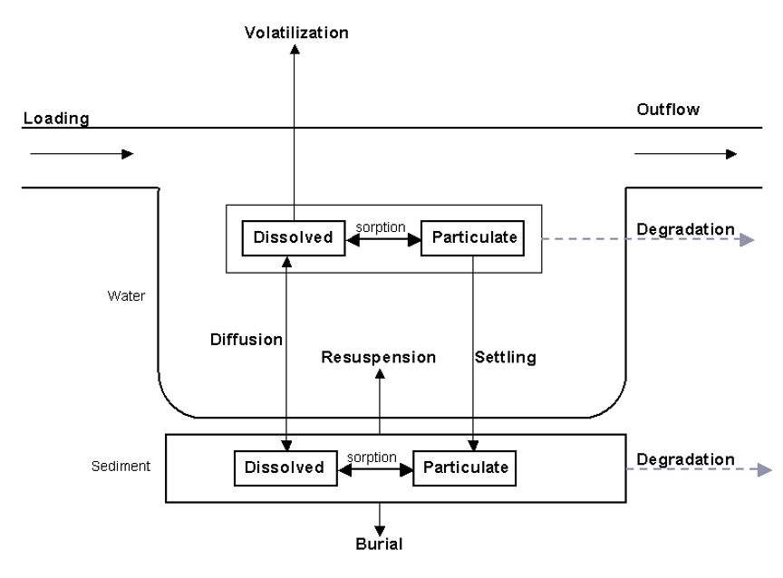

# Pesticides In Water Bodies

SWAT+ incorporates a simple mass balance developed by Chapra (1997) to model the transformation and transport of pesticides in water bodies. The model assumes a well-mixed layer of water overlying a sediment layer. Figure 8:4-1 illustrates the mechanisms affecting the pesticide mass balance in water bodies.

SWAT+ defines four different types of water bodies: ponds, wetlands, reservoirs and depressional/impounded areas (potholes). Pesticide processes are modeled only in reservoirs.

